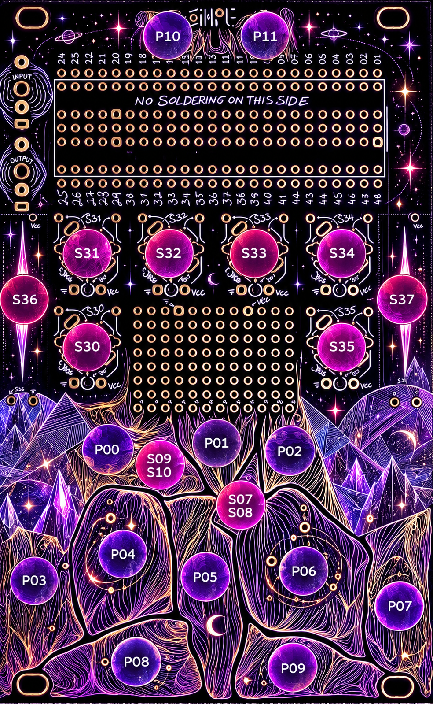

# Celestial Harmonic Synthesizer

NUUT is an experimental polyphonic synthesizer inspired by celestial harmony, astrological relationships and the idea of sound as a constellation.

The instrument explores harmonic relationships, evolving polyphonic structures and crystal-inspired sound transformations.

NUUT is being developed as an instrument for the Synthux Academy Touch 2, built around the Electro-Smith Daisy Seed platform.

## Controls

| Knob / Control | Control | Function |
|---|---|---|
| **S30** | **CONSTELLATION** | Adds additional planetary voices beyond the 3 main voices. |
| **S31** | **ORIGIN** | Controls the harmonic root / pitch center and shifts the whole system around the central tuning. |
| **S32** | **ARC** | Controls the envelope of all active voices, shaping global attack and release time. |
| **S33** | **AURA** | Controls the depth and character of the selected Crystal transformation. |
| **S34** | **REFRACTION** | Controls spatial dispersion and stereo behavior of the Crystal effects. |
| **S35** | **CRYSTAL MIX** | Controls the balance between the dry signal and the Crystal-processed signal. |
| **S36** | **TRANSIT** | Controls planetary orbital movement through the 360° system, enabling astrological events that trigger additional harmonic modulations and sonic transformations. |
| **S37** | **RADIANCE** | Controls the energy, brightness and distinctive sonic activity of the selected Crystal effect. |
| **S07 / S08** | **CRYSTAL EFFECT CHAIN** | Selects the active Crystal processing chain: **Amethyst / Aquamarine / Obsidian**. |
| **S09 / S10** | **TRANSIT MODE** | Controls the Transit movement mode; automatic movement can be disabled, evolved or accelerated. |
| **Pad 1–Pad 10** | **PLANETS** | Represent the 10 planetary bodies and determine the main planetary voices and their harmonic relationships. |
| **P11** | **HOLD** | Sustains the selected planetary voices after releasing the corresponding pads. |